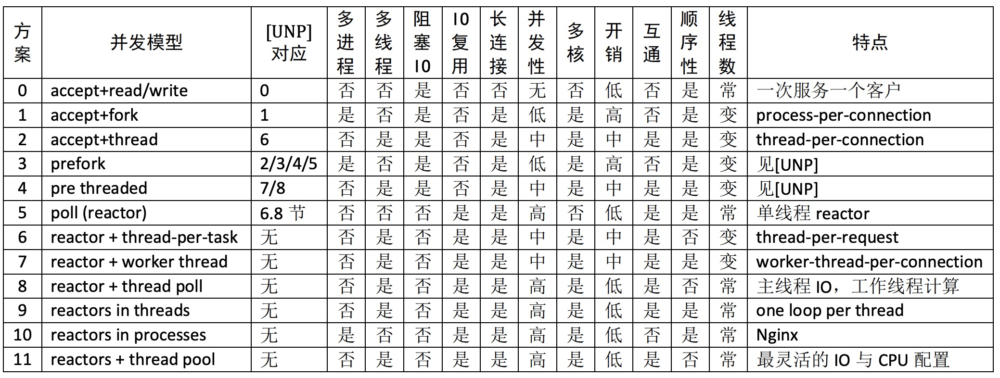

+++
author = "soli"
title = "Linux多线程服务端编程：使用muduo C++网络库.pdf"
date = "2022-12-03"
description = "做些记录"
categories = ["笔记"]
tags = ["pdf"]
series = ["Themes Guide"]
image = "https://someblogs.oss-cn-shenzhen.aliyuncs.com/thumb/img1.png"
+++
<!--more-->
## Questions
### Q1: TCP服务最大并发连接数？
即有一个 TCP 服务程序的地址是 1.2.3.4:8765，问它从理论上能接受多少个并发连接？ 
单独谈论“TCP 并发连接数”是没有意义的，因为连接数基本上是要多少有多少。更有意义的性能指标或许是：“每秒收发多少条消息”、“每秒收发多少字节的数据”、“支持多少个活动的并发客户”等等。 
在只考虑 IPv4 的情况下，并发数的理论上限是 2^48。考虑某些 IP 段被保留了，这个上界可适当缩小，但数量级不变。实际的限制是操作系统全局文件描述符的数量，以及内存大小。 
2^48由来：
一个 TCP 连接有两个 end points，每个 end point 是 {ip, port}，题目说其中一
个 end point 已经固定，那么留下一个 end point 的自由度，即 2^48。客户端 IP 的上限是 2^32 个，每个客户端 IP 发起连接的上限是 2^16，乘到一起得到理论上限 
在真实的 Linux 系统中，可以通过调整内核参数来支持上百万并发连接。
### Q2: TCP 的可靠性有多高?
> Realize That TCP Is a Reliable Protocol, Not an Infallible Protocol。

那么 TCP 在哪种情况下会出错？这里说的“出错”指的是收到的数据与发送的数据不一致，而不是数据不可达。 
什么情况下 TCP 传送的数据会出错？ 
IP header 和 TCP header 的 checksum 是一种非常弱的 16-bit check sum 算法，
其把数据当成反码表示的 16-bit integers，再加到一起。这种 checksum 算法能检出
一些简单的错误，而对某些错误无能为力。 
路由器可能出现硬件故障，比方说它的内存故障（或偶然错误）导致收发 IP 报
文出现多 bit 的反转或双字节交换，这个反转如果发生在 payload 区，那么无法用
链路层、网络层、传输层的 check sum 查出来，只能通过应用层的 check sum 来检
测。 
另外一个例证：下载大文件的时候一般都会附上 MD5，这除了有安全方面的考
虑（防止篡改），也说明应用层应该自己设法校验数据的正确性。这是 end-to-end
principle 的一个例证。
### Q4: TCP如何实现可靠？
TCP 作为一个可靠的传输层协议，其核心有三点：
1. Positive acknowledgement with retransmission；
2. Flow control using sliding window （包括 Nagle 算法等）；
3. Congestion control （包括 slow start、congestion avoidance、fast retransmit
等）。
第一点已经足以满足“可靠性”要求（为什么？）；第二点是为了提高吞吐量，充
分利用链路层带宽；第三点是防止过载造成丢包。换言之，第二点是避免发得太慢，
第三点是避免发得太快，二者相互制约。从反馈控制的角度看，TCP 像是一个自适应
的节流阀，根据管道的拥堵情况自动调整阀门的流量。
### Q3: C10K问题？
what：所谓C10K问题，就是Client 10000 Problem，即“在同时连接到服务器的客户端数量超过10000个的环境中，即便硬件性能足够，依然无法正常提供服务”这样一个问题 
what: 所谓最弱连接问题，就是如果往两端用力拉一条由很多环（连接）组成的锁链，其中最脆弱的一个连接会先断掉。因此，锁链整体的强度取决于其中最脆弱的一环。安全问题也是一样，整体的强度取决于其中最脆弱的部分。
### Q6: 常见的并发网络服务程序设计方案
