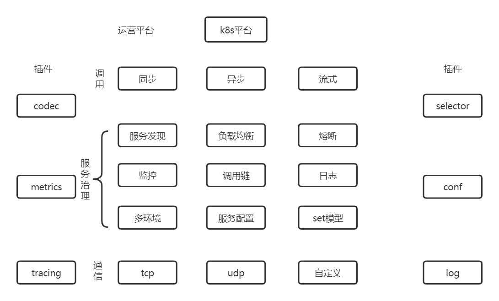
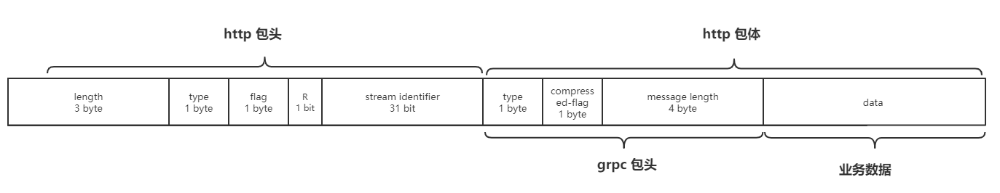
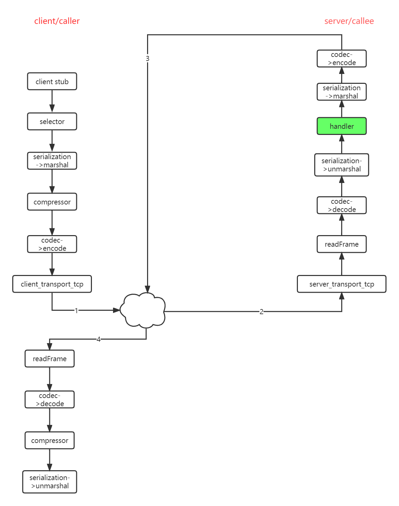

+++
author = "soli"
title = "gorpc设计与实现"
date = "2023-02-11"
description = ""
categories = ["rpc"]
tags = ["rpc"]
series = ["Themes Guide"]
image = "https://someblogs.oss-cn-shenzhen.aliyuncs.com/thumb/img1.png"
+++
<!--more-->

# 背景

> 缩短从需求到上线的距离

1. 服务端资源成本
2. 工程效率

# 设计理念
| 高性能 | 保证易用性和通用性的前提下，追求性能极致 |
| --- | --- |
| 插件化 | 支持业务对框架注入自定义处理，增强扩展能力和灵活度 |
| 测试 | 单元测试覆盖率100%，提供工具链方便业务测试 |

# 整体形态
标准化、模块化、插件化、易扩展。 

# 协议设计
协议报文：帧头+包头+包体。  帧头是固定的16个字节。 包头和包体可变长。包头通过pb序列化方式，包体支持业务自定义序列化方式。

## **协议打解包过程全剖析**
codec是协议打解包的统一接口。 rpc框架内部会通过协议名(比如http/grpc等)自动获取对应协议的Codec接口实现，也就是clientCodec和serverCodec分别实现client->server发包和解包、server->client解包和回包。

# RPC调用

## 基于protoc文件的rpc调用实现
关键代码：proxy := pb.NewGreeterClientProxy(opts...) 基于PB实现,通过提供脚手架工具生成接口代码,并生成服务模板,实现业务快速开发。

## 服务交互流程

# 插件化架构
通过框架配置文件或import的方式，易插拔，扩展灵活。

## 插件原理
框架定义了每种插件类型的标准接口。 没有具体实现,只提供map注册方式。 业务代码import即可。

# 服务治理
统一标准化接口，灵活易扩展。 通过插件对接服务治理相关系统,灵活组装自己的微服务体系。

| 插件类型 | 代表 | 具体实现 |
| --- | --- | --- |
| 名字服务 | 北极星(已开源) | 服务注册： server端main.go里会import北极星服务注册插件。rpc框架会在服务端口起来后，会自动调用register接口，也就是自动将服务名与ip_port信息注册到北极星。 服务发现： client端main.go里会import北极星服务发现插件。rpc框架的内部封装了rpc调用，会自动调用select接口，也就是自动拿到callee的ip_port。 |
| 监控 | prometheus | rpc框架对外开放counter、gauge、histogram三种类型的监控类型。提供sink接口封装了report功能。 server端main.go里会import prometheus/statusd监控上报插件。通过这个插件自动上报到监控平台。 |
| 配置 | etcd | rpc框架提供本地文件和远程配置中心那种方式，抽象出provider标准化接口。提供多种序列化方式。 |
| 调用链 | jaeger | rpc框架的包头可变长，其中包含metadata信息，并对外暴露get和set标准接口，可用于集成服务可观测性功能。 |
| 日志 | zap | rpc框架支持通过配置文件里注册日志插件，实现根据日志级别按console或file模式写入指定文件名并自动滚动。 |

# 拦截器
假设有一个方法 handler(ctx context.Context) ，我想要给这个方法赋予一个能力：允许在这个方法执行之前能够打印一行日志。同时，保证handler方法只执行一次。

## 自定义一个拦截器

1. 定义处理逻辑函数
2. 注册到框架中
3. 配置文件开启使用
