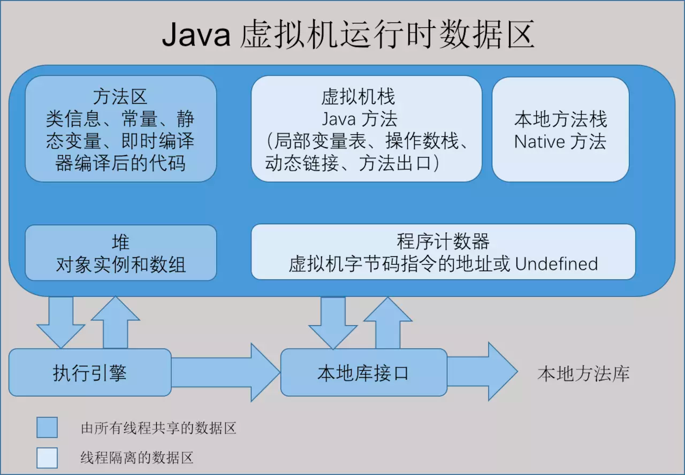

+++
author = "soli"
title = "java-notes"
date = "2022-06-18"
description = "编程语言Java学习笔记"
categories = [
"language"
]
tags = [
"java"
]
series = ["Themes Guide"]
aliases = ["migrate-from-jekyl"]
image = "java-logo.png"
+++
<!--more-->
## 并发编程

并发工具类：
## JVM
### JVM内存区域

### 垃圾回收