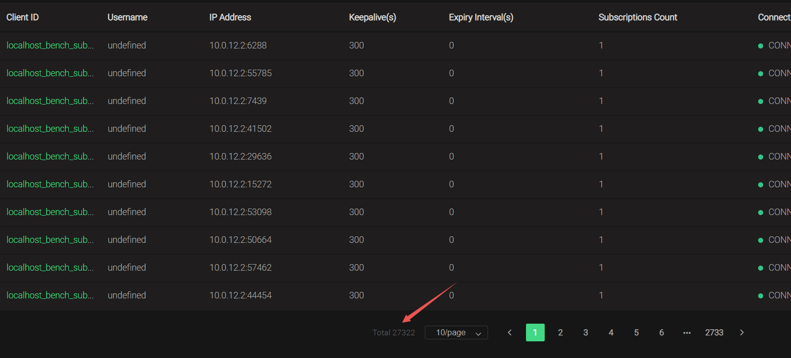

+++
author = "soli"
keywords = ["cockymang","mqtt broker","in action","mqttaction"]
title = "MQTT Broker in Action"
date = "2022-11-13"
description = "MQTT消息服务器实战"
categories = [
"mqtt"
]
tags = [
"inaction","emqx"
]
series = ["Themes Guide"]
image = "https://someblogs.oss-cn-shenzhen.aliyuncs.com/thumb/img1.png"
+++
<!--more-->
> EMQX 是一款大规模可弹性伸缩的云原生分布式物联网 MQTT 消息服务器:joy:。
### Docker单节点多实例
基于docker-compose+haproxy搭建伪分布式集群：<br>
启动：docker-compose -f docker-compose-emqx-cluster.yaml up<br>
关闭：docker-compose -f docker-compose-emqx-cluster.yaml down
### Docker多节点
修改emqx.conf配置文件(这里选择static方式)，集群节点开放某些端口：
```conf
cluster.discovery = static
cluster.static.seeds = emqx@120.92.94.79,emqx@120.92.88.242
rpc.port_discovery = manual
rpc.tcp_server_port = 5369
```
两个集群节点分别执行以下命令：
```sh
docker run -d --name emqx_cluster -v /emqx.conf:/opt/emqx/etc/emqx.conf -v /emqx_auth_mysql.conf:/opt/emqx/etc/plugins/emqx_auth_mysql.conf -v /loaded_plugins:/opt/emqx/data/loaded_plugins --env EMQX_LOG__TO=both --env EMQX_HOST=120.92.94.79 -p 1883:1883 -p 8081:8081 -p 8083:8083 -p 8084:8084 -p 8883:8883 -p 18083:18083 -p 4370:4370 -p 5370:5370 -p 4369:4369 -p 5369:5369 -p 6369:6369 -p 6370:6370 emqx/emqx:4.4.4
```
### k8s集群
见另外一篇文章，传送门
## 安全
安全主要包括服务端访问控制和客户端SDK安全，具体如下：<br>
服务端启用emqx_auth_mysql插件实现认证和授权。<br>
客户端SDK引入的第三方库， 要走中台统一的三方库报备、审查，看看有没有漏洞或其他风险。
## 客户端SDK
一些SDK不支持mqtt5.0，其影响是pub/sub操作无法拿到原因码。一些SDK不支持断线重连。<br>
注意点：client_id尽量不填(或者重连时采用第一次连接后返回的client_id)，避免client_id重复导致会话互踢。<br>
Go版本建议选择[paho.golang](https://github.com/eclipse/paho.golang)，因为支持5.0协议。<br>
C++版本建议选择[paho.mqtt.cpp](https://github.com/eclipse/paho.mqtt.cpp)，也可以参考我写的[一个基于vcpkg+cmake的demo](https://github.com/blessli/mqtt-cpp-demo)<br>
JS版本建议选择[ws-mqtt](https://github.com/emqx/MQTT-Client-Examples/blob/master/mqtt-client-WebSocket/ws-mqtt.html)
## 压力验证
[压测工具](https://github.com/emqx/emqtt-bench)<br>
硬件配置：一台腾讯云服务器2c4g。<br>
一个master节点的k8s上运行emqx 6个pod，目前只能支持27322个订阅端，服务器CPU 100%。<br>
### 遇到的问题
client(4): EXIT for {shutdown,eaddrinuse}<br>
解决方法：<br>
扩大端口数量<br>
提高端口使用率<br>

