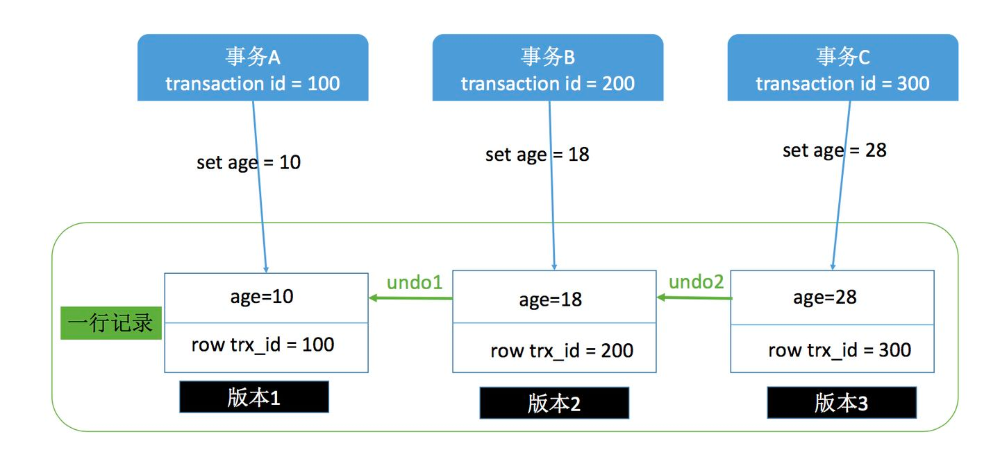

+++
author = "soli"
title = "mysql-notes"
date = "2022-06-18"
description = "关系型数据库MySQL学习笔记"
categories = [
"database"
]
tags = [
"mysql"
]
series = ["Themes Guide"]
aliases = ["migrate-from-jekyl"]
image = "mysql-logo.png"
+++
<!--more-->
## 索引
### 索引底层数据结构选型
> 哈希表、二叉查找树、平衡二叉树、B树、B+树、跳表。

## 事务
### 并发事务问题
> 脏读、不可重复读、幻读。
## 日志
> redo、undo、bin。

## 锁
> 行锁和表锁。
### 乐观锁MVCC

可重复读：事务开始的时候生成一个当前事务全局性的快照  
读提交：每次执行语句的时候都重新生成一次快照  
对于一个快照来说，它能够读到那些版本数据，要遵循以下规则：   
当前事务内的更新，可以读到；  
版本未提交，不能读到  
版本已提交，但是却在快照创建后提交的，不能读到     
版本已提交，且是在快照创建前提交的，可以读到  