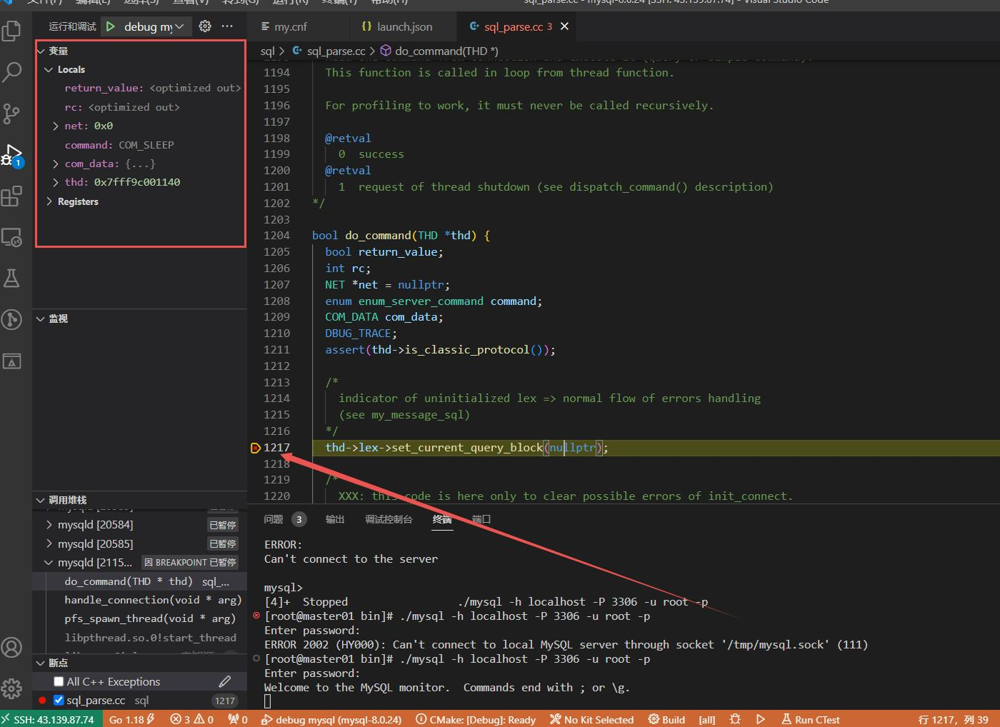

+++
author = "soli"
keywords = ["cockymang","mqtt broker","in action","mqttaction"]
title = "mysql source code learning"
date = "2022-11-14"
description = "带着些许问题去源码中找答案"
categories = ["database"]
tags = ["mysql","sourcecode"]
series = ["Themes Guide"]
image = "https://someblogs.oss-cn-shenzhen.aliyuncs.com/thumb/img2.png"
+++
<!--more-->
## 问题探索
### 一条SQL的生命周期
[参考文章](https://blog.mipa.site/2020/06/021934.html)
### 网络IO模型
[参考文章](https://blog.51cto.com/u_15069490/2937369)
## 其他
### mysql8.0.24源码编译安装
主要是参考[这篇文章](https://www.cnblogs.com/jhno1/p/15324343.html#autoid-0-8-0)，操作过程中根据报错进行fix
### 编译安装问题
1. OpenSSL 版本不兼容<br>
不兼容1.1版本，需要openssl1.0.2，通过yum install openssl-devel。<br>
2. 磁盘空间不足<br>
60g磁盘满了，导致make 终止，/data目录删掉即可。<br>
```sh
fatal error: error writing to /tmp/ccFtecZv.s: No space left on device
```
3. 内存不足<br>
需要开启swap分区
```sh
g++: internal compiler error: Killed (program cc1plus)
```
4. 太吃内存，make巨慢<br>
没找到解决方案...
5. 缺少依赖组件<br>
可能是缺少ncurses-devel
```sh
yum install ncurses-devel libaio bison zlib-devel openssl openssl-devel patch
```
### mysqld启动问题
1. 磁盘空间不足
> 注意my.cnf配置文件，特别innodb参数配置，可能因系统内存或磁盘容量导致启动失败

查看系统磁盘: df -h<br>
[InnoDB] Error number 28 means 'No space left on device'
### vscode本地调试mysql8.0.24
先在云服务器上执行以下命令：
```sh
./mysqld --initialize --user=mysql --basedir=/usr/local/mysql --datadir=/usr/local/mysql/data
```
launch.json配置文件如下：
```json
{
    "version": "0.2.0",
    "configurations": [
        {
            "name": "debug mysql",
            "type": "cppdbg",
            "request": "launch",
            "program": "/usr/local/mysql/bin/mysqld",
            "args": ["--defaults-file=/usr/local/mysql/etc/my.cnf"],
            "stopAtEntry": false,
            "cwd": "${workspaceFolder}",
            "environment": [],
            "externalConsole": false
        }
    ]
}
```
