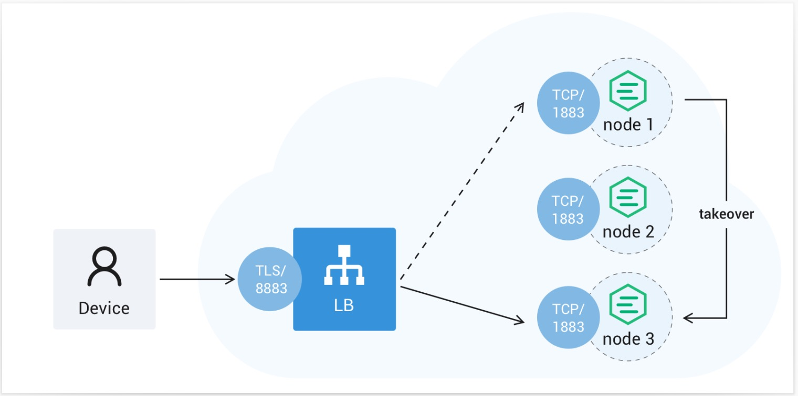
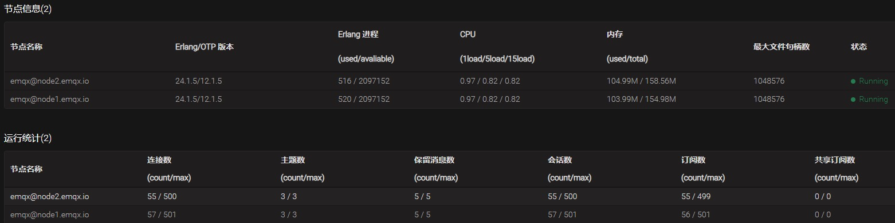
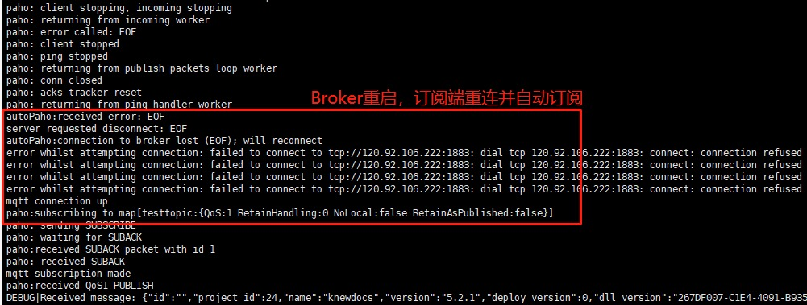
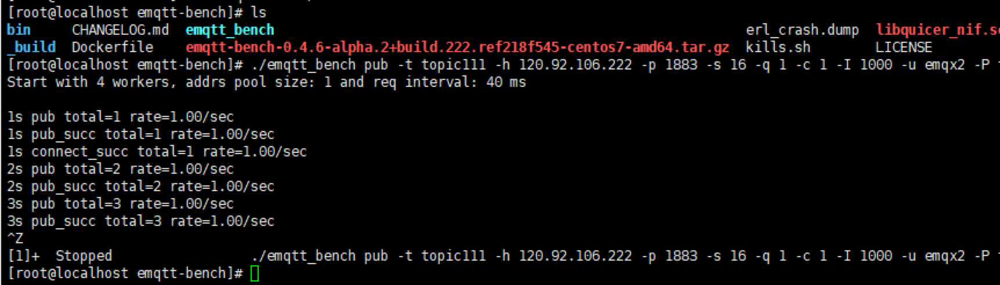
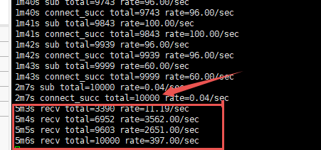

+++
author = "soli"
title = "【实战】如何快速部署开源服务器并应用于业务场景"
date = "2022-10-30"
description = "快速部署MQTT消息服务器"
categories = [
"实战","中间件"
]
tags = [
"消息中间件"
]
series = ["Themes Guide"]
aliases = ["migrate-from-jekyl"]
image = "https://lidongming.oss-cn-shenzhen.aliyuncs.com/mysite/img1.png"
+++
<!--more-->

## 背景
当需要提供一种新能力，考虑到成本问题，我们往往不会从0到1开发一个服务器，而是先在开源产品中选型对比，看是否已有能满足自身需求的开源产品(不重复造轮子的原则)。因为对开源服务器的不熟悉，部署过程中会踩这样那样的坑，效率比较低，如何快速部署并应用于实际业务场景呢？ 随便提一下，私有化部署的原因主要是考虑到数据安全，**安全无小事，安全大于一切**

## 准备工作

1. 云主机(内部安装了docker、docker-compose、防火墙开放指定端口)
2. 个人电脑(内部安装了docker-desktop、xshell、vscode、golang)
3. 仔细看[官方文档](https://www.emqx.io/docs/zh/v5.0/)以及官方开源社区
> 注意：emqx是4.4.4版本

## 部署

### 预期效果
(配置文件、日志)文件/目录挂载到本地磁盘 监控、告警、可视化等功能 协议接入、集群部署、接入安全

### 具体流程
个人电脑 -> 云主机 单机版 -> 集群版(负载均衡)

## 启动
> 仔细检查docker-compose-emqx-cluster.yaml 配置文件，否则会启动失败

启动命令： docker-compose -f docker-compose-emqx-cluster.yaml up &  

## 接入安全
在loaded_plugins配置文件中启用emqx_auth_mysql插件。

{emqx_management,true}.
{emqx_dashboard,true}.
{emqx_modules,false}.
{emqx_recon,true}.
{emqx_retainer,true}.
{emqx_telemetry,true}.
{emqx_rule_engine,true}.
{emqx_bridge_mqtt,false}.
{emqx_auth_mysql,true}.

emqx默认是不设置权限，需要修改acl.conf启用鉴权。

{allow, {user, "dashboard"}, subscribe, ["$SYS/#"]}.
{allow, {ipaddr, "127.0.0.1"}, pubsub, ["$SYS/#", "#"]}.
{deny, all, subscribe, ["$SYS/#", {eq, "#"}]}.

修改emqx_auth_mysql.conf配置文件：修改数据库实例，创建认证表和授权表。 
用户名/密码认证防止非法客户端连接。

CREATE TABLE `mqtt_user` (
  `id` int(11) unsigned NOT NULL AUTO_INCREMENT,
  `username` varchar(100) DEFAULT NULL,
  `password` varchar(100) DEFAULT NULL,
  `salt` varchar(35) DEFAULT NULL,
  `is_superuser` tinyint(1) DEFAULT '0',
  `created` datetime DEFAULT NULL,
  PRIMARY KEY (`id`),
  UNIQUE KEY `mqtt_username` (`username`)
) ENGINE=InnoDB AUTO_INCREMENT=9 DEFAULT CHARSET=utf8mb4


对 MQTT 客户端的发布和订阅操作进行权限控制。控制哪些客户端可以发布或者订阅哪些MQTT主题。


CREATE TABLE `mqtt_acl` (
  `id` int(11) unsigned NOT NULL AUTO_INCREMENT,
  `allow` int(1) DEFAULT '1' COMMENT '0: deny, 1: allow',
  `ipaddr` varchar(60) DEFAULT NULL COMMENT 'IpAddress',
  `username` varchar(100) DEFAULT NULL COMMENT 'Username',
  `clientid` varchar(100) DEFAULT NULL COMMENT 'ClientId',
  `access` int(2) NOT NULL COMMENT '1: subscribe, 2: publish, 3: pubsub',
  `topic` varchar(100) NOT NULL DEFAULT '' COMMENT 'Topic Filter',
  PRIMARY KEY (`id`),
  KEY `ipaddr` (`ipaddr`),
  KEY `username` (`username`),
  KEY `clientid` (`clientid`)
) ENGINE=InnoDB AUTO_INCREMENT=13 DEFAULT CHARSET=utf8mb4


## 集群部署
实际业务场景可能对高性能、高可用有着一定要求。 

version: '3.9'

x-default-emqx: &default-emqx
    image: emqx/emqx:4.4.4
    env_file:
      - conf.cluster.env
    healthcheck:
      test: ["CMD", "/opt/emqx/bin/emqx_ctl", "status"]
      interval: 5s
      timeout: 25s
      retries: 5

services:
  haproxy:
    container_name: haproxy
    image: haproxy:2.4
    privileged: true
    depends_on:
      - emqx1
      - emqx2
    volumes:
      - ./haproxy/haproxy.cfg:/usr/local/etc/haproxy/haproxy.cfg
      - ./certs_ha/certs:/usr/local/etc/haproxy/certs
    ports:
      - "18083:18083"
      - "1883:1883"
#     - "8883:8883"
      - "8083:8083"
#     - "8084:8084"
      - "9090:9090"
      - "8081:8081"
    networks:
      - emqx_bridge
    working_dir: /usr/local/etc/haproxy
    command:
      - bash
      - -c
      - |
        set -x
        cat /usr/local/etc/haproxy/certs/cert.pem /usr/local/etc/haproxy/certs/key.pem > /tmp/emqx.pem
        haproxy -f /usr/local/etc/haproxy/haproxy.cfg

  emqx1:
    <<: *default-emqx
    container_name: node1.emqx.io
    environment:
      - "EMQX_HOST=node1.emqx.io"
    ports:
      - "18081:18083"
      - "8881:8083"
      - "1882:1883"
      - "18087:8081"
    networks:
      emqx_bridge:
        aliases:
        - node1.emqx.io
    volumes:
      - ./dockeremqx/emqx.conf:/opt/emqx/etc/emqx.conf
      - ./dockeremqx/acl.conf:/opt/emqx/etc/acl.conf
      - ./dockeremqx/emqx_auth_mysql.conf:/opt/emqx/etc/plugins/emqx_auth_mysql.conf
      - ./dockeremqx/loaded_plugins:/opt/emqx/data/loaded_plugins
      - ./dockeremqx/emqx1_log/log:/opt/emqx/log

  emqx2:
    <<: *default-emqx
    container_name: node2.emqx.io
    environment:
      - "EMQX_HOST=node2.emqx.io"
    ports:
      - "18082:18083"
      - "8882:8083"
      - "1881:1883"
      - "18088:8081"
    networks:
      emqx_bridge:
        aliases:
        - node2.emqx.io
    volumes:
      - ./dockeremqx/emqx.conf:/opt/emqx/etc/emqx.conf
      - ./dockeremqx/acl.conf:/opt/emqx/etc/acl.conf
      - ./dockeremqx/emqx_auth_mysql.conf:/opt/emqx/etc/plugins/emqx_auth_mysql.conf
      - ./dockeremqx/loaded_plugins:/opt/emqx/data/loaded_plugins
      - ./dockeremqx/emqx2_log/log:/opt/emqx/log

networks:
  emqx_bridge:
    driver: bridge
    name: emqx_bridge
    # ipam:
    #   driver: default
    #   config:
    #     - subnet: 172.100.239.0/24
    #       gateway: 172.100.239.1


## 协议接入
应用层协议包括mqtt、websocket、http。负载均衡器方面的配置非常关键，下面以haproxy为例(核心配置)： 粘性会话是在haproxy中配置的。

defaults
    log global
    mode http
    option httplog
    # Replace 1024000 with deployment connections
    maxconn 50000
    timeout connect 30000
    timeout client 600s
    timeout server 600s
    timeout tunnel 1h
    timeout client-fin 30s
    timeout http-keep-alive  5s
    timeout http-request    5s
frontend emqx_tcp
   mode tcp
   option tcplog
   bind *:1883
   # Reject connections that have an invalid MQTT packet
   # tcp-request content reject unless { req.payload(0,0), mqtt_is_valid }
   default_backend emqx_tcp_back
frontend emqx_ws
   mode tcp
   option httplog
   bind *:8083
   acl host_ws hdr_beg(Host) -i ws.
   acl hdr_connection_upgrade hdr(Connection)  -i upgrade
   acl hdr_upgrade_websocket  hdr(Upgrade)     -i websocket
   use_backend emqx_ws_back if hdr_connection_upgrade hdr_upgrade_websocket
   default_backend emqx_ws_back
backend emqx_tcp_back
    mode tcp
    stick on req.payload(0,0),mqtt_field_value(connect,client_identifier)
    server emqx-1 node1.emqx.io:1883 check-send-proxy send-proxy-v2
    server emqx-2 node2.emqx.io:1883 check-send-proxy send-proxy-v2
backend emqx_ws_back
    mode http
    balance roundrobin
    acl hdr_connection_upgrade hdr(Connection)                 -i upgrade
    acl hdr_upgrade_websocket  hdr(Upgrade)                    -i websocket
    acl hdr_websocket_key      hdr_cnt(Sec-WebSocket-Key)      eq 1
    acl hdr_websocket_version  hdr_cnt(Sec-WebSocket-Version)  eq 1
    server emqx-1 node1.emqx.io:8083
    server emqx-2 node2.emqx.io:8083


## 测试

### 功能测试
目标：连接、发布、订阅等功能符合预期。 EMQX是否正在运行的判断方法：正常进入管理后台界面、正常监听某些指定端口。 运行指定语言的客户端SDK来进行关键功能测试，比如golang版本的SDK [paho.golang  ](https://github.com/eclipse/paho.golang)，JS版本的SDK [mqtt-client-WebSocket  ](https://github.com/emqx/MQTT-Client-Examples/blob/master/mqtt-client-WebSocket/ws-mqtt.html)。当然也可以通过官方推荐的可视化工具来测试。

#### 测试方法
| 测试点 | 期望结果 | 具体说明 |
| --- | --- | --- |
| 客户端断线重连 | emqx重启后，客户端自动重连 | 取决于客户端SDK是否实现了心跳重连 |
| 消息下发成功率 | 正常情况下，QoS 1报文不会丢失消息 | Broker提供3种QoS，通常选择QoS 1报文(至少送达一次)来兼顾吞吐量和发布质量。 |
| 消息状态码 | 每次操作都能拿到实时且正确的状态码 | 状态码是MQTT 5.0新特性，客户端SDK需要支持5.0协议 |

### 性能测试
目标：确认是否与官方宣称的性能接近(机器硬件条件相同情况下)，提前暴露可能存在的BUG

#### 测试方法
一般官方都会提供配套的压测工具脚本，比如[emqtt-bench开源项目](https://github.com/emqx/emqtt-bench)，将其运行在云主机，压测效果最好，减少网络传输时延。

 ./emqtt_bench sub -t bench -h ${ip} -p 1883 -c 1000 -i 10 -q 1 -u ${username}-P ${password}  


#### 压测注意事项
压测客户端被限制：ulimit命令修改进程最大连接数限制，否则会压测不准，最大并发连接数卡在1007上不去。 发布端发送消息速率过快：  max_mqueue_len参数默认为1000，队列满会消息发送失败  负载均衡器maxconn设置过小：haproxy的maxconn默认值是1000，需要调大为50000  

## 总结
搭建开源服务器，需要实现协议接入、集群部署、接入安全等核心功能来满足业务需求，最终目的是为业务带来一定的价值。
