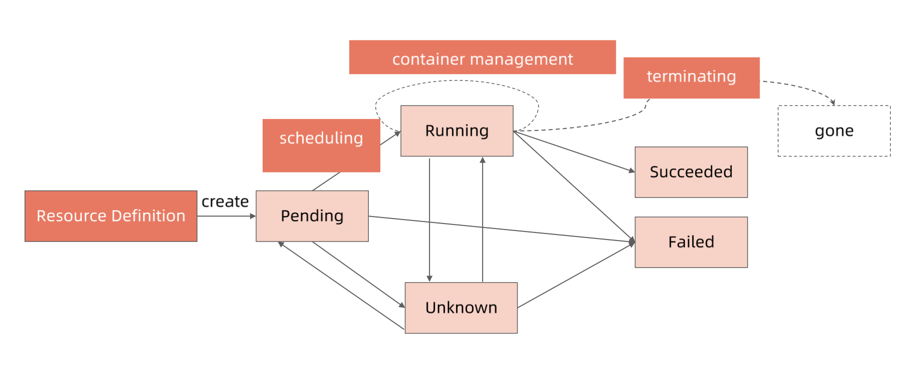

+++
author = "soli"
title = "k8s-notes"
date = "2022-06-18"
description = "运维K8s学习笔记"
categories = [
"middleware"
]
tags = [
"k8s"
]
series = ["Themes Guide"]
aliases = ["migrate-from-jekyl"]
image = "img.png"
+++
<!--more-->
## k8s概述
> 自动化运维管理Docker(容器化)程序。
## 核心特性
## pod状态流转
