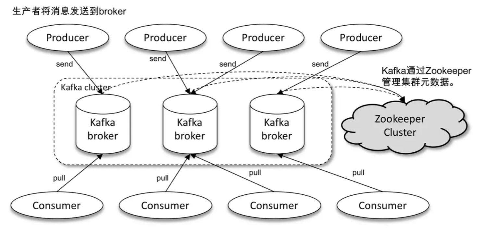

+++
author = "soli"
title = "kafka简介"
date = "2022-06-18"
description = "消息中间件Kafka学习笔记"
categories = [
"middleware"
]
tags = [
"kafka"
]
series = ["Themes Guide"]
aliases = ["migrate-from-jekyl"]
image = "img.png"
+++
<!--more-->
## Kafka概述
> 体系架构、多副本机制、分区机制。

## Kafka的生产者(客户端)
## Kafka的消费者(客户端)
## Kafka的服务端
### Kafka的协调者
## Kafka的存储层
### Kafka日志结构
## Kafka常见问题讨论
- Kafka是如何保障数据不丢失的？
- 如何解决Kafka数据丢失问题？
- Kafka可以保障永久不丢失数据吗？
- 如何保障Kafka中的消息是有序的？
- 如何确定Kafka主题的分区数量？
- 如何调整生产环境中Kafka主题的分区数量？
- 如何重平衡Kafka集群？
- 如何查看消费者组是否存在滞后消费？
## PageCache
1. 缓存最近被访问的数据
2. 预读功能
## 消息顺序性问题
> 分区有序而不是主题有序。分区有序是通过offset实现的。
## 分区机制
一个主题不可能只对应一个文件(单机I/O会成为性能瓶颈)
一个主题包含多个分区，每个分区是一个可追加的日志文件。不同分区在不同broker上。
## 消息中间件选型
1. 功能维度(延时队列)
2. 性能维度()
3. 可靠性和可用性
4. 运维管理
5. 社区力度和生态发展