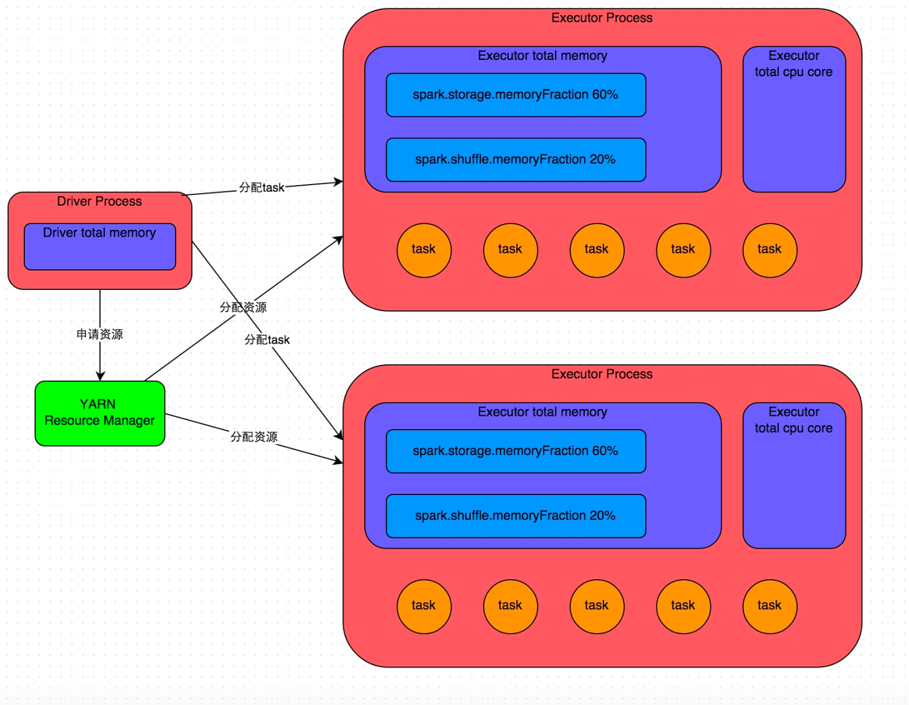
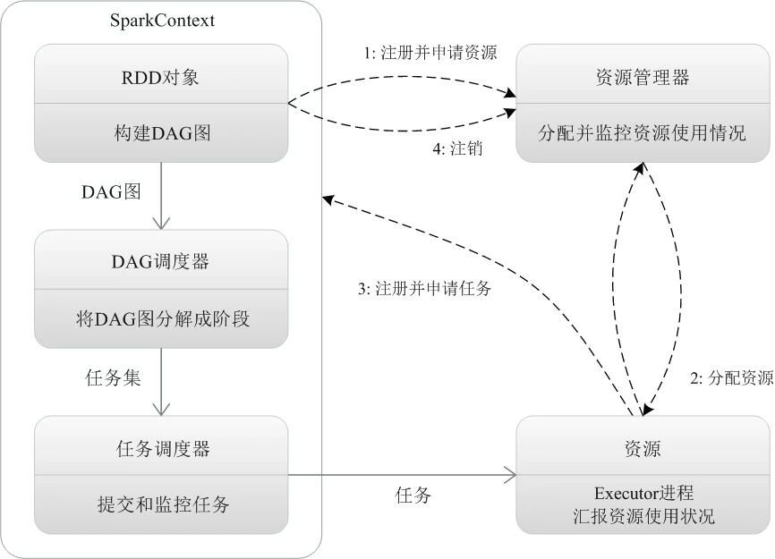

+++
author = "soli"
title = "spark原理浅析"
date = "2022-06-18"
description = "大数据Spark学习笔记"
categories = [
"大数据"
]
tags = [
"spark"
]
series = ["Themes Guide"]
aliases = ["migrate-from-jekyl"]
image = "https://someblogs.oss-cn-shenzhen.aliyuncs.com/thumb/img7.png"
+++
<!--more-->
## Spark概述
> 一个高效通用的内存型分布式计算框架。

Spark特点：
1. 速度快
2. 易用使用
3. 通用性
4. 运行模式多样
## Spark作业基本运行原理

## 运行流程
