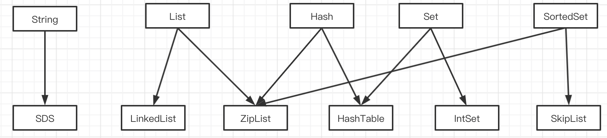
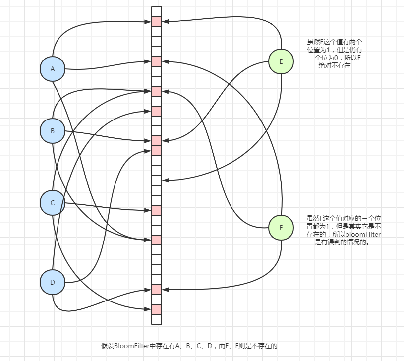

+++
author = "soli"
title = "redis-notes"
date = "2022-06-18"
description = "内存型数据库Redis学习笔记"
categories = [
"database"
]
tags = [
"redis"
]
series = ["Themes Guide"]
aliases = ["migrate-from-jekyl"]
image = "redis-logo.png"
+++
<!--more-->
## Redis概述
## 核心数据结构

## 持久化
> RDB+AOF混用
## I/O多路复用
## Redis常见问题讨论
1. 击穿问题：底层数据库有数据而缓存内没有数据
2. 穿透问题：底层数据库没有数据且缓存内也没有数据。解决方法：布隆过滤器
3. 雪崩问题：缓存击穿的"大面积"版

