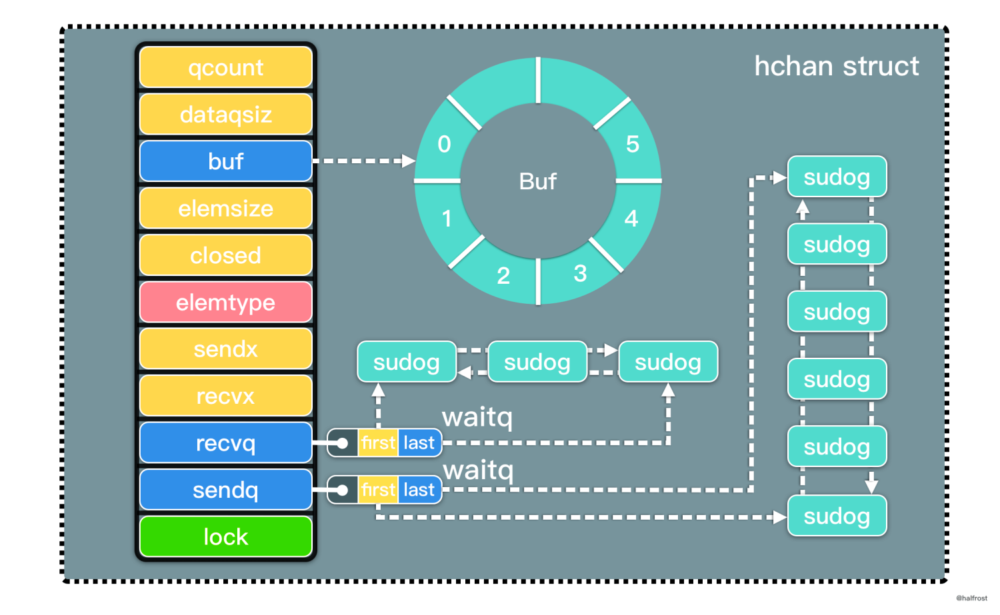
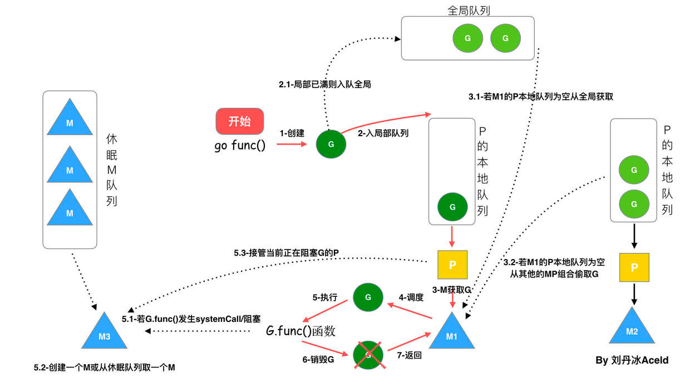
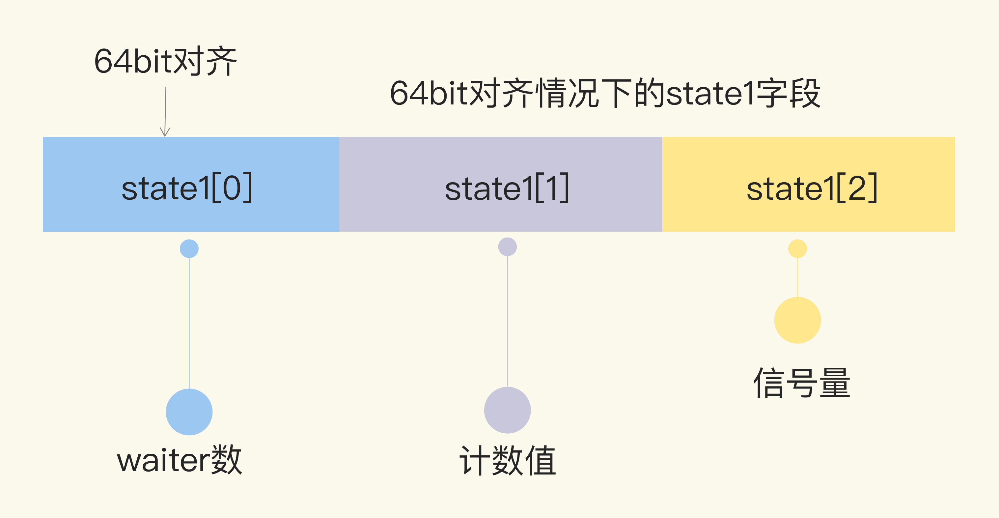

+++
author = "soli"
title = "golang简介"
date = "2022-06-18"
description = "golang简介"
categories = [
"language"
]
tags = [
"golang"
]
series = ["Themes Guide"]
aliases = ["migrate-from-jekyl"]
image = "static/img.png"
+++
<!--more-->
## Golang概述
## Channel

## GMP调度模型

## Mutex
## WaitGroup
