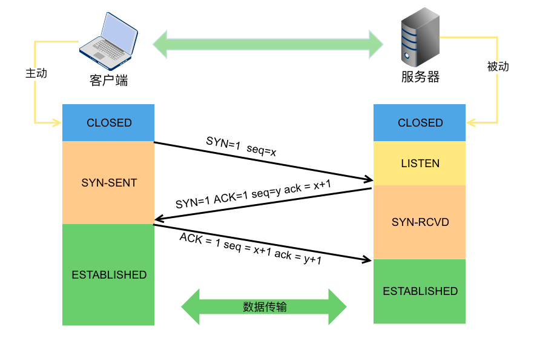
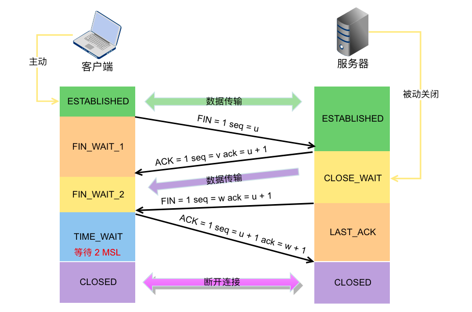

+++
author = "soli"
title = "网络之运输层TCP协议"
date = "2022-07-09"
description = "连接管理、流量控制、拥塞控制"
categories = [
"internet"
]
tags = [
"tcp"
]
series = ["Themes Guide"]
aliases = ["migrate-from-jekyl"]
image = "static/img.png"
+++
<!--more-->
## 传输控制协议TCP协议概述
### TCP最主要的特点
### TCP的连接
## 可靠传输的工作原理
### 停止等待协议
### 连续ARQ协议
## TCP可靠传输的实现
### 以字节为单位的滑动窗口
### 超时重传时间的选择
### 选择确认SACK
## TCP的流量控制
### 利用滑动窗口实现流量控制
### TCP的传输效率
## TCP的拥塞控制
### 拥塞控制的一般原理
### TCP的拥塞控制方法
## TCP的运输连接管理
### 连接建立

### 连接释放

### TCP常见问题讨论
1. time_wait和close_wait产生过多的原因和解决方法