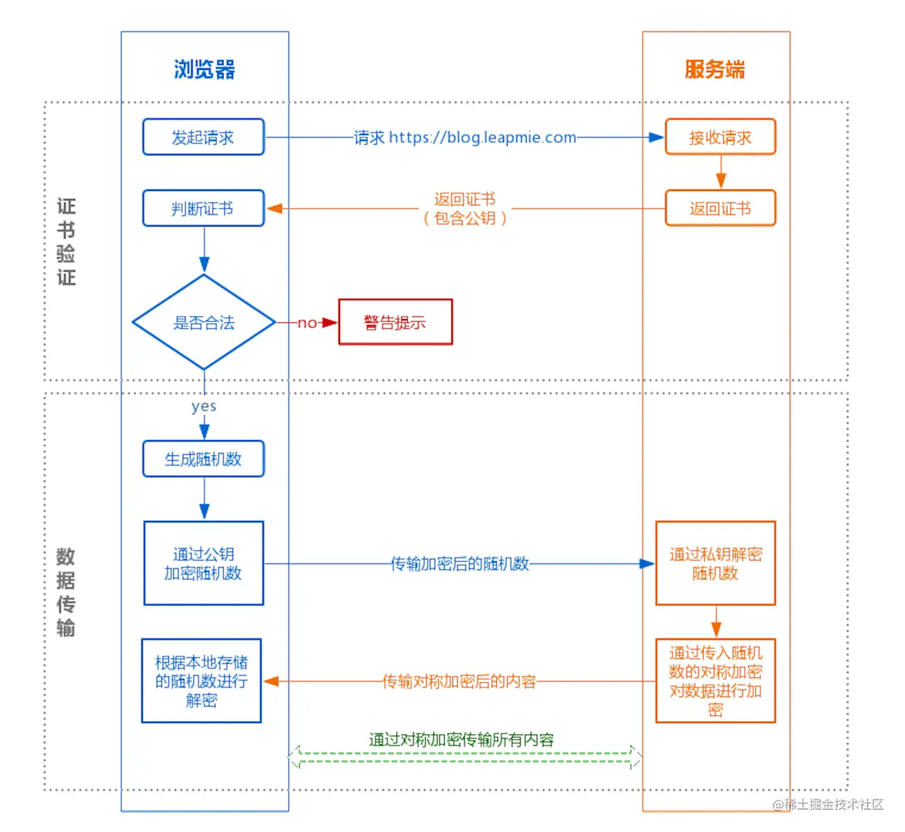

+++
author = "soli"
title = "tcp/ip-notes"
date = "2022-06-21"
description = "网络TCP/IP学习笔记"
categories = [
"net"
]
tags = [
"tcp/ip"
]
series = ["Themes Guide"]
aliases = ["migrate-from-jekyl"]
image = "tcpip-logo.png"
+++
<!--more-->
## 传输层
### 三次握手

### 四次挥手

### TCP常见问题讨论
1. time_wait和close_wait产生过多的原因和解决方法
## 应用层-HTTPS

## 网络层
### IP
### ARP