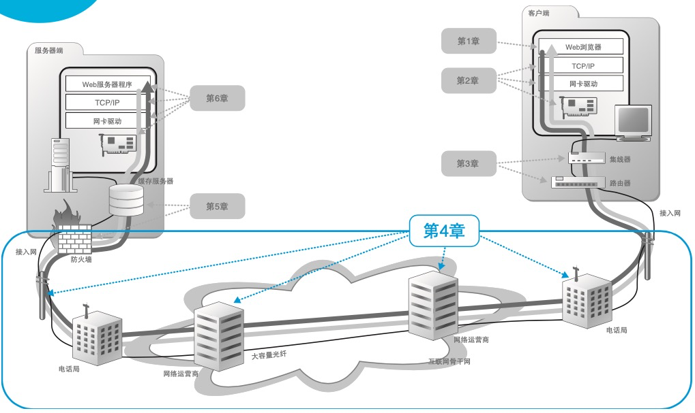

+++
author = "soli"
title = "【读书笔记】网络是怎样连接的"
date = "2022-10-09"
description = "重点介绍了实际的网络设备和软件是如何工作的"
categories = [
"读书笔记","网络"
]
tags = [
"网络"
]
series = ["Themes Guide"]
aliases = ["migrate-from-jekyl"]
image = "https://someblogs.oss-cn-shenzhen.aliyuncs.com/thumb/img0.png"
+++
<!--more-->
> 从在浏览器中输入网址，到屏幕上显示出网页的内容，在这个只有几秒钟的过程中，很多硬件和软件都在各自的岗位上相互配合完成了一系列的工作。 

## 浏览器生成消息
## 用电信号传输TCP/IP
## 从网络到网络设备
## 通过接入网进入互联网内部
## 请求到达web服务器，响应返回浏览器

